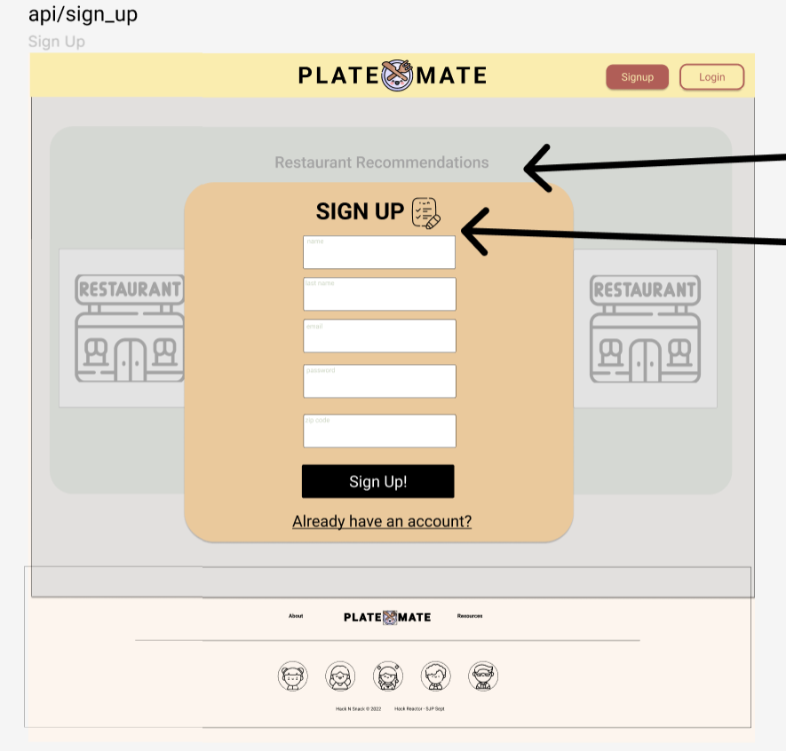
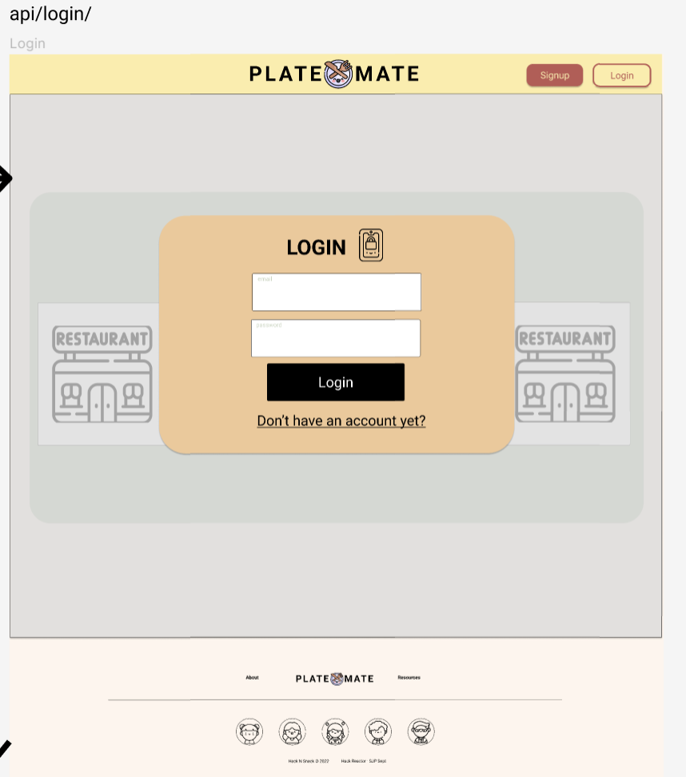
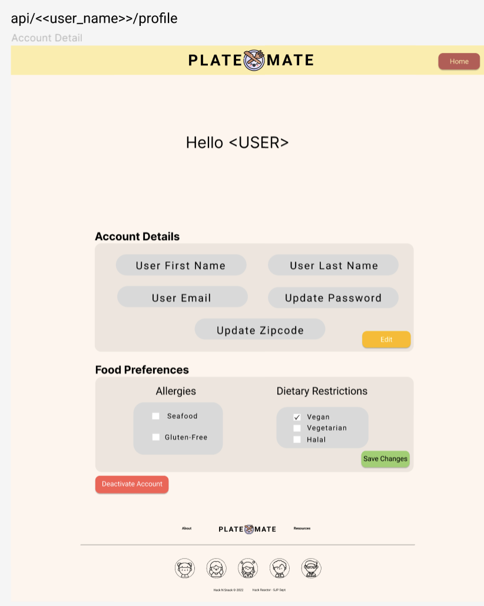
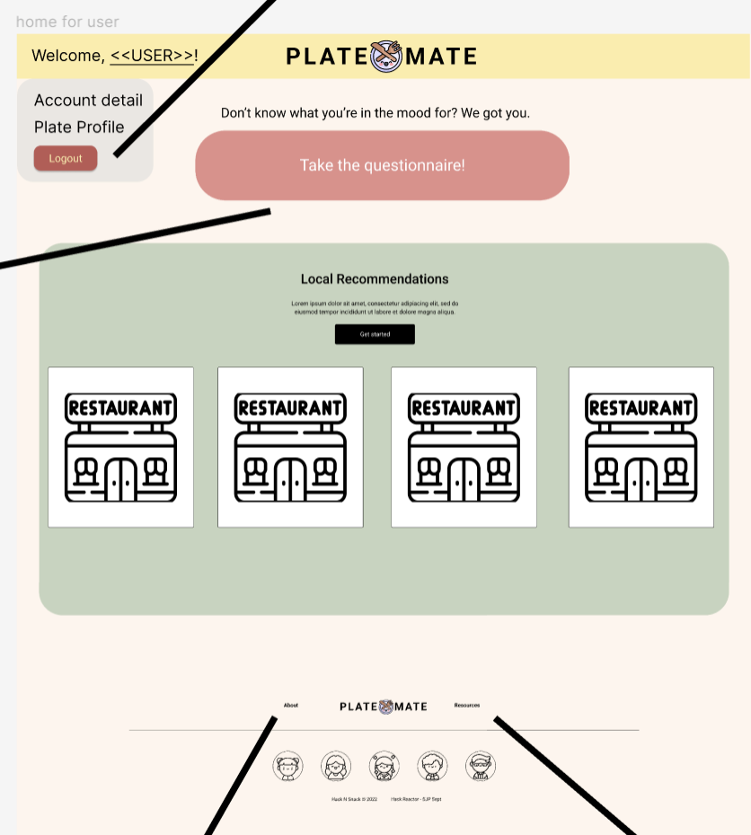
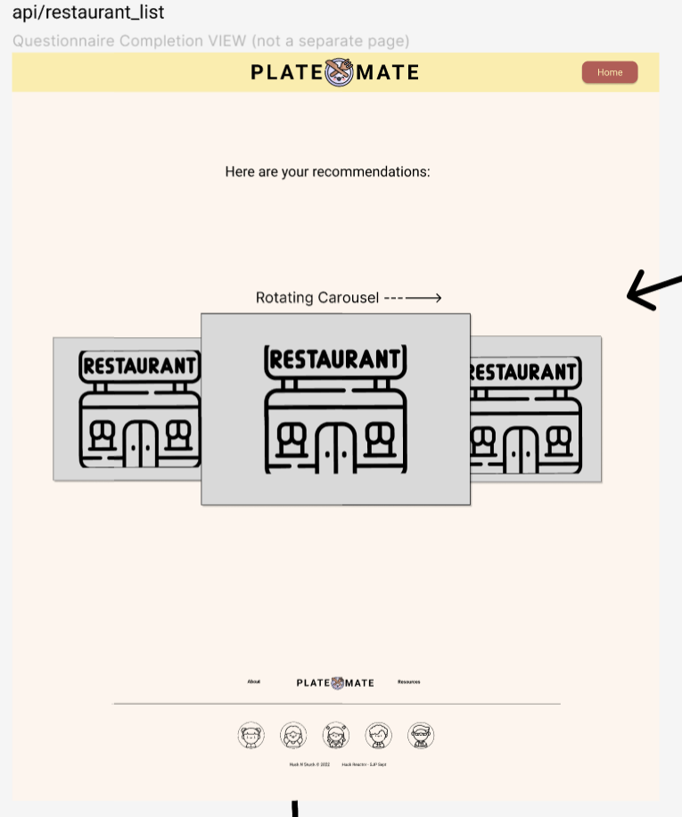
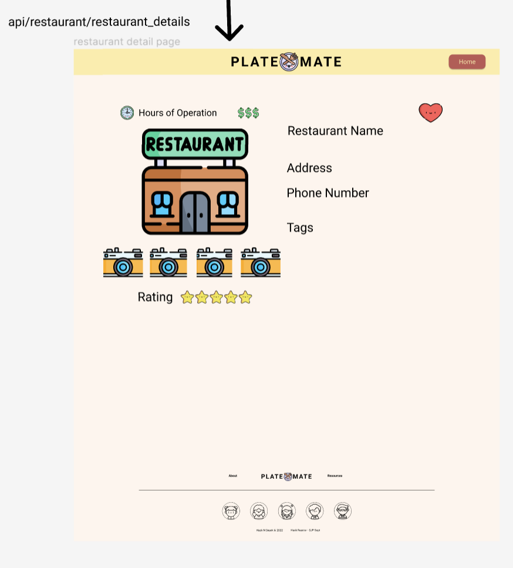
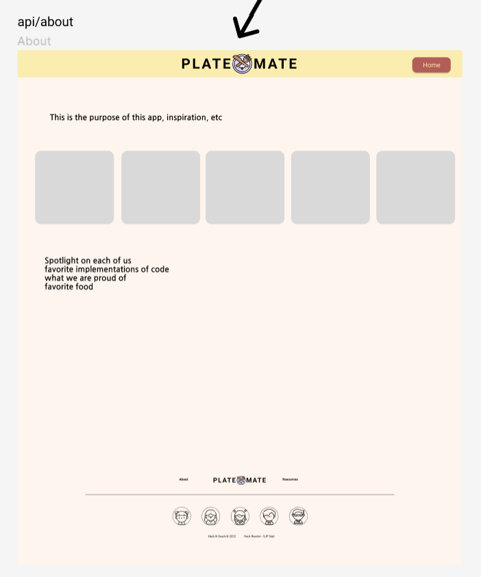
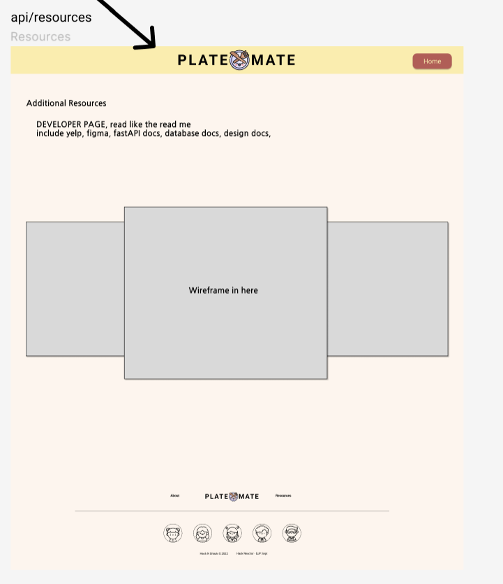

# Graphical Human Interface

## Wireframe

An outline of the wireframe that the team created on Figma.

## Landing Page

This is the landing page, where a user can log in. Or if they do not have an account, they can navigate to the sign up page from here.

## Sign Up Page

If a user needs to sign up, this is where they will input thier info.

## Login Page

If a user needs to log in, this is where they will input thier username and password.

## Profile Page

Once a user has either logged in or completed the sign up form, they will be brought to their own profile page. Here, they can update thier account information, and modify diet restrictions.

Once a user is logged in, they are able to use the questionnaire.

## Home

Once a user is logged in, the landing page becomes "HOME". From here, you are able to take the questionnaire and navigate throughout the site using the navbar.

## Questionnaire

A user who is logged in may use the questionnaire. It will ask multiple questions to determine the best place to eat.

![questionnaire]./images/Questionnaire.png)

## Restaurants List

After taking the questionnaire, the user will be presented with a maximum of three different results of restaurants that match thier wants and needs.

## Restaurant Detail

Upon clicking a restaurant in the restaurant-list, the user will be redirected to a restaurant detail page. It will display recent reviews, open times, and ratings.

## About

Any user may click the about section. This page displays a little blurb from the developers, and the inspiration behind the app.

## Resources

Any user may click the resources section. This page displays all resources used while building the application, and a brief description of each.

